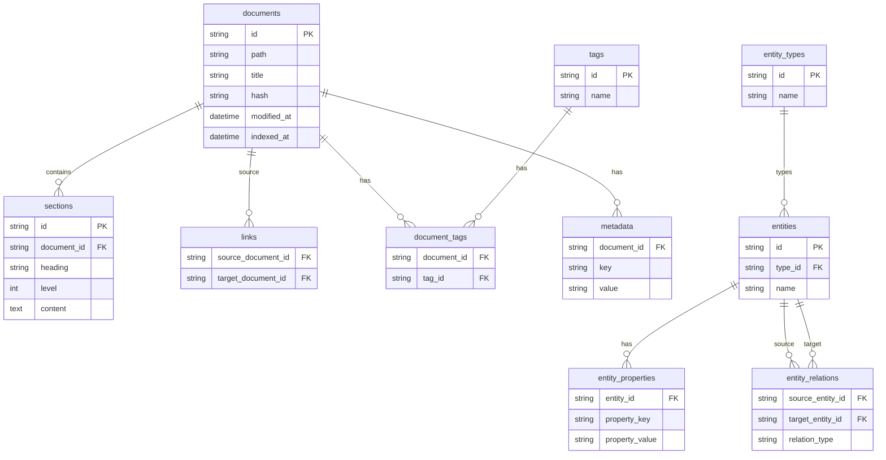
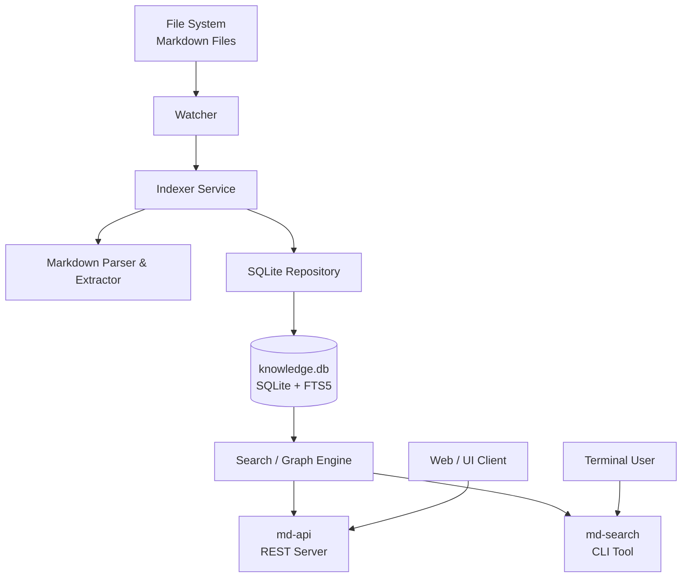

# Markdown Knowledge Indexer & Search Engine

This project provides a local, lightweight knowledge-graph and search infrastructure for Markdown-based note systems (such as Obsidian). The system consists of three core components:

1. **md-indexer**: Monitors Markdown files and incrementally builds a SQLite-based index and knowledge graph. Markdown files remain the single source of truth.
2. **md-search**: A CLI knowledge explorer that operates on the SQLite database (without filesystem access) to perform full-text search, backlink, and graph traversal queries.
3. **md-api**: A REST API that exposes the search and graph features over HTTP.

## Architectural Principles

The system is based on the principles of **Clean Architecture**:
- **Source of Truth**: Markdown files in the filesystem are the only truth. The SQLite database is a pure materialized index and can be deleted and rebuilt at any time.
- **Separation of Concerns**: Strict separation between file parsing (`md-indexer`) and query operations (`md-search` & `md-api`). The search layer has no filesystem access and reads exclusively from the database.

## Data Model & ER Diagram (SQLite & FTS5)



## Component Diagram



## Setup & Build

The project uses a Makefile for the build process.

```bash
# Build all components (in ./bin)
make build    # md-indexer
make search   # md-search
make api      # md-api

# Run all tests
make test
```

### Docker (Multi-Stage Build)

Alternatively, the system can be deployed entirely via Docker:

```bash
docker build -t md-knowledge-system .
docker run -p 8080:8080 -p 8081:8081 -v /pfad/zum/vault:/app/vault md-knowledge-system
```

## Usage & Examples

### 1. md-indexer (File Watcher & Indexer)

Indexes a folder recursively and monitors it for future changes.

```bash
./bin/md-indexer -dir /path/to/obsidian/vault -db index.db -port 8080
```

### 2. md-search (CLI Explorer)

Allows searching the graph from the terminal. The `-db` flag can be set (default is `index.db`).

```bash
# Full-text search via FTS5 (title, content, tags)
./bin/md-search search "encryption strategy"

# Format output as JSON
./bin/md-search search "encryption strategy" --json

# Show details for a specific document
./bin/md-search document "ADR-003"
```

**(In development / partially implemented)**:
```bash
./bin/md-search entity "Transformation Engine"
./bin/md-search backlinks "Encryption Service"
./bin/md-search relations "Transformation Engine"
./bin/md-search impact "Package Model"
```

### 3. md-api (REST API)

Starts an HTTP server that accepts search requests (default port 8081).

```bash
make api-run
# or manually:
./bin/md-api -db index.db -port 8081
```

**Endpoints:**

- `GET /health`: System status
- `GET /api/search?q=...`: FTS5 full-text search
- `GET /api/documents/{name}`: Load a specific document
- `GET /api/entities/{name}`: Load an extracted entity (type + properties)
- `GET /api/backlinks/{name}`: Find documents that link to `{name}`

*(The exact specification is documented in the included `openapi.yaml` file).*
